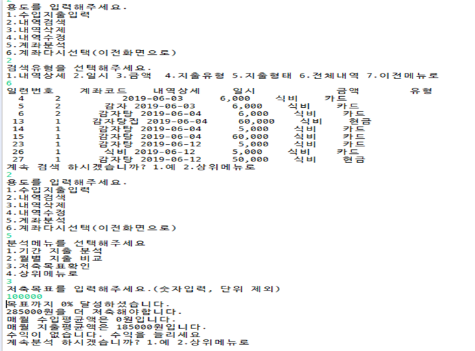

# AccountManagement
가계부 프로그램(MVC 디자인 패턴 Model,Control) View는 콘솔로 대체

환경
-------------
apache tomcat 9 / 로컬 mysql

### 라이브러리 다운로드
mysql jdbc connector : https://dev.mysql.com/downloads/connector/j/

-------------

### 구현
#### Domain
Account : 가계부 계정 목록 / AccountItem : 가계부 계정 당 지출수입목록 //one to many
#### DAO
GenricDAO로 구성
#### Service
화면설계서 3개 서비스 구현
#### UI
main / console 출력메시지
#### 실행

